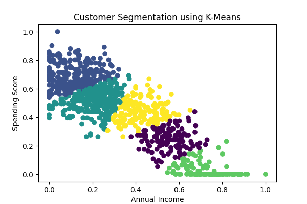
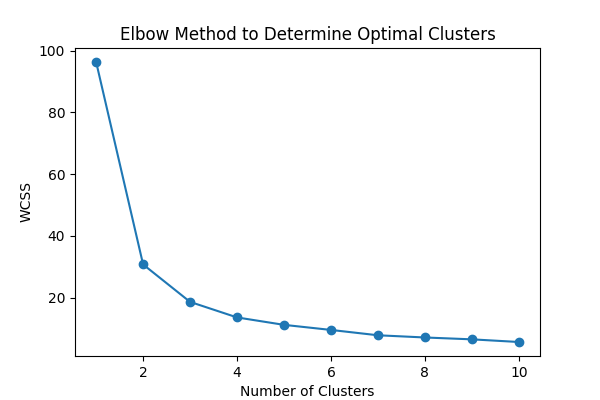
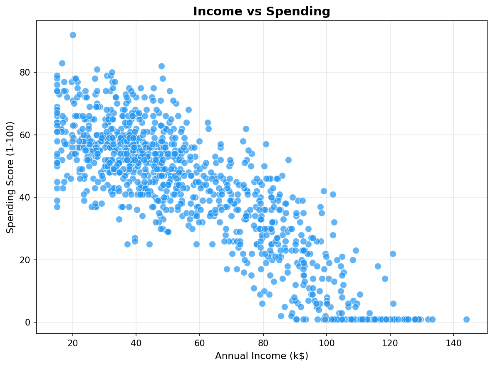
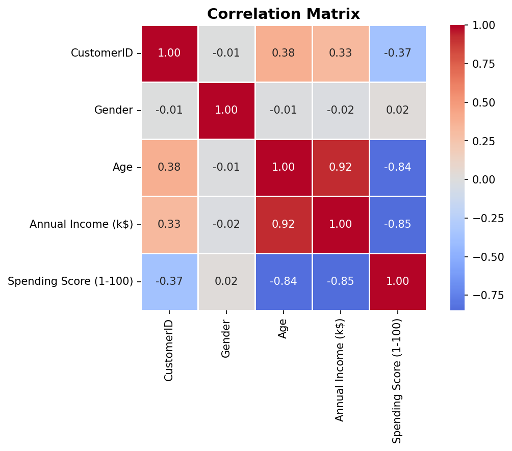
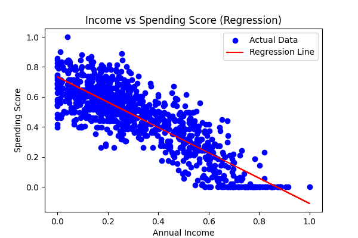
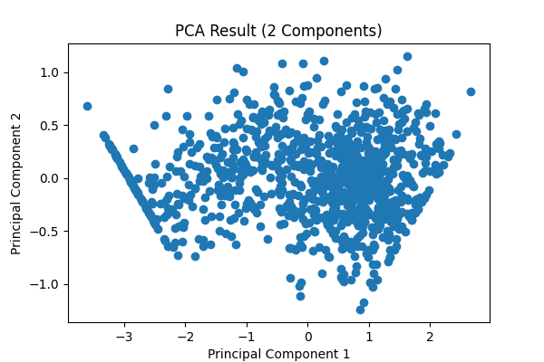

# 🧠 DMW Project – Customer Behavior Analysis  
### *Data Mining & Data Warehousing Capstone*

---

## 📌 Overview

**Dataset:** Mall Customer Segmentation Dataset  
**Tools Used:** Python, Scikit-learn, Jupyter  

This project implements a complete **Data Mining + Data Warehouse pipeline** to analyze mall customer behavior and generate actionable business insights.

It integrates:
- Clustering (Customer Segmentation)
- Classification (Prediction Models)
- Regression (Trend Analysis)
- Association Rule Mining (Apriori)
- Data Warehouse + OLAP (Decision Support)

---

## 🎯 Objectives

- Segment customers based on income & spending  
- Predict customer categories using ML models  
- Analyze demographic patterns  
- Discover hidden relationships (Apriori)  
- Build Star Schema Data Warehouse  
- Perform OLAP operations  

---

## 📂 Project Structure

```
DMW_Project/
│
├── data/
│   ├── raw/
│   └── processed/
│
├── notebooks/
│   ├── 01_preprocessing.ipynb
│   ├── 02_eda.ipynb
│   ├── 03_pca.ipynb
│   ├── 04_kmeans.ipynb
│   ├── 05_classification.ipynb
│   ├── 06_regression.ipynb
│   ├── 07_apriori.ipynb
│   ├── 08_warehouse_olap.ipynb
│   └── 09_main_pipeline.ipynb
│
├── src/
├── outputs/
└── README.md
```

---

# 📊 Key Results

## 🔹 Classification Performance

| Model | Accuracy |
|------|---------|
| Decision Tree | 55.84% |
| SVM | **62.94% (Best)** |

✔ SVM performs better due to stronger decision boundaries  
✔ Dataset shows moderate separability  

---

## 🔹 Regression Analysis

- Model: Linear Regression  
- Insight:  
  - Income alone is NOT a strong predictor of spending  
  - Customer behavior varies significantly  

---

## 🔹 Association Rules (Apriori)

| Rule | Confidence |
|------|-----------|
| High Income → Low Spending | 98% |
| High Spending → Low Income | 99% |

✔ Reveals unexpected customer behavior  
✔ Useful for marketing strategies  

---

## 🔹 Clustering Insights

- Optimal Clusters: **5 (Elbow Method)**  

| Cluster | Description |
|--------|------------|
| 0 | Low Income – Low Spending |
| 1 | Low Income – High Spending |
| 2 | Medium Segment |
| 3 | High Income – Low Spending |
| 4 | High Income – High Spending |

---

# 📈 Visualizations

## 🔹 Customer Segmentation


## 🔹 Elbow Method


## 🔹 Income vs Spending


## 🔹 Correlation Matrix


## 🔹 Regression Analysis


## 🔹 PCA Visualization


---

# 🔄 Data Pipeline

```
Raw Data
   ↓
Preprocessing
   ↓
EDA
   ↓
PCA
   ↓
Clustering
   ↓
Classification
   ↓
Regression
   ↓
Apriori
   ↓
Data Warehouse + OLAP
```

---

# 🏗️ Data Warehouse Design

## ⭐ Star Schema

- **Fact Table:**  
  - Spending Score  
  - Annual Income  

- **Dimension Tables:**  
  - Age  
  - Gender  
  - Income Category  

---

## 🔍 OLAP Operations

- Roll-up → Aggregation  
- Drill-down → Detailed analysis  
- Slice → Filter one dimension  
- Dice → Multi-condition filtering  

---

# ⚙️ Tech Stack

- Python  
- Pandas, NumPy  
- Scikit-learn  
- Matplotlib, Seaborn  
- MLxtend  
- Jupyter Notebook  

---

# 🚀 How to Run

```bash
pip install -r requirements.txt
jupyter notebook
```

Run notebooks in order:

```
01 → 02 → 03 → 04 → 05 → 06 → 07 → 08 → 09
```

---

# 🧠 Key Insights

- Customers with similar income behave differently  
- High income does not always mean high spending  
- 5 distinct customer segments identified  
- SVM performs best among classification models  
- Strong association rules found in behavior patterns  

---

# 🏆 Project Highlights

✔ Covers ALL syllabus modules  
✔ Modular architecture (industry-style)  
✔ Multiple ML techniques  
✔ Data Warehouse + OLAP included  
✔ Strong visualization support  
✔ End-to-end pipeline  

---

# 🔮 Future Improvements

- Add Random Forest (recommended upgrade 🔥)  
- Build interactive dashboard (Streamlit)  
- Add real-time data processing  
- Advanced clustering (DBSCAN)  


---

# 👨‍💻 Authors

- Parth Ahuja  
 

---