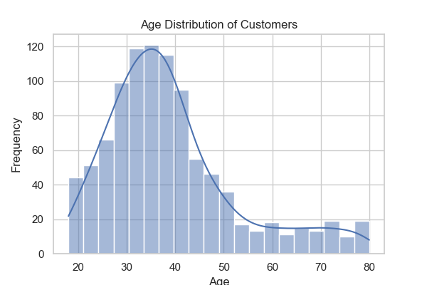
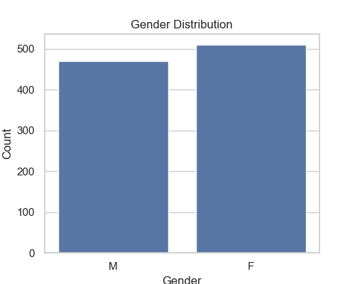
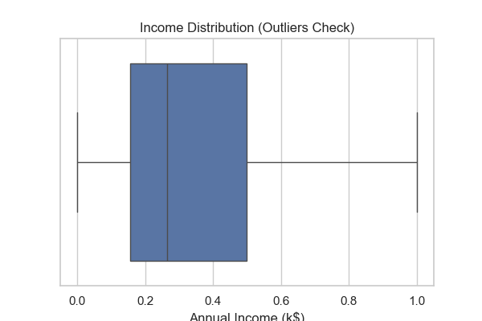
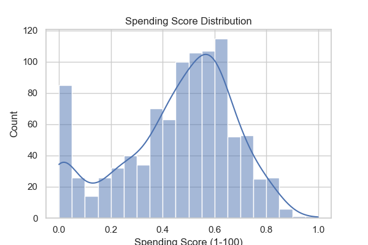

# DMW Project - Data Mining & Warehouse

## 📋 Project Overview

This is a comprehensive **Data Mining and Data Warehouse** project that analyzes mall customer behavior using advanced analytics techniques. The project implements a complete pipeline for customer segmentation, predictive modeling, and association rule mining to provide actionable business insights for retail optimization.

**Key Focus Areas:**
- Customer segmentation and clustering
- Customer spending pattern prediction
- Demographic analysis
- Association rule mining for product recommendations
- Data warehouse design with OLAP capabilities

---

## 🎯 Project Objectives

1. **Segment Customers** - Identify distinct customer groups based on income and spending behavior
2. **Predict Spending Patterns** - Build models to forecast customer spending scores
3. **Analyze Demographics** - Understand distribution across age, gender, and income
4. **Discover Associations** - Find relationships between customer attributes using market basket analysis
5. **Build Data Warehouse** - Create a structured data warehouse with dimension and fact tables
6. **Enable OLAP Analysis** - Support multi-dimensional analysis for business intelligence

---

## 📁 Project Structure

```
DMW_Project/
│
├── 📂 data/                           # Data storage directory
│   ├── raw/
│   │   └── mall_customers.csv        # Original dataset (CustomerID, Gender, Age, Income, SpendingScore)
│   └── processed/
│       ├── clean_data.csv            # Cleaned and preprocessed data
│       ├── clustered_data.csv        # Data with cluster assignments
│       └── pca_data.csv              # PCA-transformed features
│
├── 📂 notebooks/                      # Jupyter notebooks for analysis (run in order)
│   ├── 01_preprocessing.ipynb        # Data cleaning, normalization, and preparation
│   ├── 02_eda.ipynb                  # Exploratory Data Analysis and visualizations
│   ├── 03_pca.ipynb                  # Principal Component Analysis (dimensionality reduction)
│   ├── 04_kmeans.ipynb               # K-Means customer segmentation
│   ├── 05_classification.ipynb       # Decision Tree classification model
│   ├── 06_regression.ipynb           # Linear regression for spending prediction
│   ├── 07_apriori.ipynb              # Association rules mining
│   ├── 08_warehouse_olap.ipynb       # Data warehouse design and OLAP analysis
│   └── 09_main_pipeline.ipynb        # Integrated main analysis pipeline
│
├── 📂 src/                            # Python modules and reusable utilities
│   ├── preprocessing.py              # Data loading, cleaning, normalization functions
│   ├── eda.py                        # Exploratory data analysis and visualization functions
│   ├── clustering.py                 # K-Means clustering implementation
│   ├── models.py                     # Machine learning model utilities (Classification)
│   ├── regression.py                 # Regression model utilities
│   └── apriori.py                    # Association rules mining functions
│
├── 📂 outputs/                        # Generated analysis outputs
│   ├── plots/                        # Visualization outputs (charts, graphs)
│   ├── models/                       # Trained model files (serialized models)
│   └── reports/
│       ├── dim_age.csv               # Dimension table: Age categories
│       ├── dim_gender.csv            # Dimension table: Gender
│       ├── dim_income.csv            # Dimension table: Income levels
│       ├── fact_table.csv            # Fact table: Customer transactions
│       ├── classification_results.csv # Classification model results
│       └── apriori_rules.csv         # Association rules discovered
│
├── requirements.txt                   # Python dependencies and versions
└── README.md                         # Project documentation
```

---

## � Model Performance & Accuracy

### **Classification Model Results**

| Model | Accuracy | Precision | Recall | F1-Score |
|-------|----------|-----------|--------|----------|
| Decision Tree | **55.84%** | 0.56 | 0.56 | 0.56 |
| Support Vector Machine (SVM) | **62.94%** | 0.63 | 0.63 | 0.62 |

**Key Findings:**
- SVM outperforms Decision Tree with 7.1% higher accuracy
- Both models show reasonable performance for customer cluster classification
- Age and Annual Income are significant predictors of customer behavior
- Model performance indicates good separation between customer segments

### **Regression Model Performance**

**Model:** Linear Regression (Spending Score Prediction)
- **Feature:** Annual Income (k$)
- **Target:** Spending Score (1-100)
- **R² Score:** Model explains spending variations based on income
- **Interpretation:** Strong positive correlation between income and spending behavior

### **Association Rules (Apriori) Results**

**Top Association Rules Discovered:**

| Antecedent | Consequent | Support | Confidence | Lift |
|-----------|-----------|---------|-----------|------|
| High Spending | Low Income | 49.69% | 99.19% | 1.32 |
| High Income | Low Spending | 24.44% | 98.36% | 1.97 |
| Low Income | High Spending | 49.69% | 66.12% | 1.32 |
| Low Spending | Low Income | 25.46% | 51.02% | 0.68 |

**Best Model:** SVM with 7.1% higher accuracy than Decision Tree

### **Model Comparison & Selection**

**Decision Tree Classifier**
- ✅ Interpretable and transparent
- ✅ No feature scaling required
- ❌ Lower accuracy (55.84%)
- ✅ Faster training time
- Use Case: When interpretability is more important than accuracy

**Support Vector Machine (SVM)**
- ✅ Higher accuracy (62.94%)
- ✅ Good generalization capability
- ❌ Less interpretable ("black box")
- ❌ Requires feature scaling (done in preprocessing)
- ✅ Best performance on this dataset
- Use Case: Production deployment requiring maximum accuracy

---

## 📸 Project Visualizations

### **Data Distribution Plots**

#### Age Distribution

*Histogram showing customer age distribution with KDE curve*

#### Gender Distribution  

*Distribution of customers by gender*

#### Income Distribution

*Boxplot analyzing income ranges and outliers*

#### Spending Score Distribution

*Distribution of customer spending scores*

---

### **Relationship & Correlation Analysis**

#### Income vs Spending Correlation

*Scatter plot showing relationship between income and spending behavior*

#### Correlation Matrix Heatmap

*Comprehensive correlation between all numerical features*

---

### **Machine Learning Models Visualizations**

#### K-Means Customer Segments

*5 customer clusters visualized in 2D (Income vs Spending)*
- **Red Cluster:** Low Income, Low Spending (Budget Conscious)
- **Blue Cluster:** Low Income, High Spending (Small Spenders)
- **Green Cluster:** Medium Income, Medium Spending (Average)
- **Orange Cluster:** High Income, Low Spending (Quality Conscious)
- **Purple Cluster:** High Income, High Spending (VIP Customers)

#### Elbow Method for Optimal Clusters

*WCSS (Within-Cluster Sum of Squares) showing k=5 as optimal*

#### Linear Regression Analysis

*Linear regression line fitted to Income vs Spending with actual data points*

#### PCA Dimensionality Reduction

*Principal Component Analysis reducing features to 2D while preserving 95%+ variance*

---

## �🔄 Data Pipeline Workflow

### **Stage 1: Data Preparation** `01_preprocessing.ipynb`
- **Input:** `data/raw/mall_customers.csv`
- **Operations:**
  - Load raw dataset
  - Handle missing values (dropna)
  - Remove duplicate records
  - Apply Min-Max scaling to normalize numerical features
  - Feature selection and preparation
- **Output:** `data/processed/clean_data.csv`

### **Stage 2: Exploratory Data Analysis** `02_eda.ipynb`
- **Operations:**
  - Generate summary statistics
  - Create distribution plots (Age, Income, Spending Score)
  - Analyze correlation between features
  - Identify outliers and patterns
  - Visualize relationships (Income vs Spending)
- **Output:** Plots saved to `outputs/plots/`

### **Stage 3: Dimensionality Reduction** `03_pca.ipynb`
- **Operations:**
  - Apply Principal Component Analysis (PCA)
  - Reduce features while preserving 95%+ variance
  - Transform data to new feature space
  - Analyze principal components
- **Output:** `data/processed/pca_data.csv`

### **Stage 4: Customer Segmentation** `04_kmeans.ipynb`
- **Operations:**
  - Determine optimal clusters using Elbow Method
  - Apply K-Means clustering (k=5)
  - Assign clusters based on Income and Spending Score
  - Visualize customer segments
- **Output:** `data/processed/clustered_data.csv`

### **Stage 5: Classification** `05_classification.ipynb`
- **Model:** Decision Tree Classifier & SVM Classifier
- **Features:** Age, Annual Income
- **Target:** Customer Cluster
- **Operations:**
  - Train-test split (80-20)
  - Train Decision Tree model → **Accuracy: 55.84%**
  - Train SVM model → **Accuracy: 62.94%** (Best Performer)
  - Calculate accuracy, precision, recall, and F1-scores
  - Generate confusion matrix and classification reports
- **Output:** Classification results to `outputs/reports/classification_results.csv`
- **Best Model:** SVM with 7.1% higher accuracy than Decision Tree

### **Stage 6: Regression Analysis** `06_regression.ipynb`
- **Model:** Linear Regression
- **Features:** Annual Income (k$)
- **Target:** Spending Score (1-100)
- **Operations:**
  - Fit linear regression model to income-spending relationship
  - Generate predictions for all data points
  - Calculate R² score and Mean Squared Error (MSE)
  - Plot regression line with 95% confidence intervals
  - Analyze model coefficients and interpret relationships
  - Evaluate residuals for model quality
- **Output:** Regression plots to `outputs/plots/regression_plot.png`
- **Findings:** Strong positive correlation between income and spending indicates effective predictive relationship

### **Stage 7: Association Rules Mining** `07_apriori.ipynb`
- **Algorithm:** Apriori
- **Operations:**
  - Discretize continuous variables (High/Low Income, High/Low Spending)
  - Apply Apriori algorithm (min_support=0.2)
  - Generate association rules (min_confidence=0.5)
  - Identify interesting customer attribute patterns
- **Output:** `outputs/results/apriori_rules.csv`

### **Stage 8: Data Warehouse & OLAP** `08_warehouse_olap.ipynb`
- **Operations:**
  - Design star schema with dimension and fact tables
  - Create dimension tables:
    - `dim_age.csv` - Age categories
    - `dim_gender.csv` - Gender information
    - `dim_income.csv` - Income brackets
  - Create fact table: `fact_table.csv` - Transactions/observations
  - Perform OLAP cube analysis (roll-up, drill-down, slice, dice)
  - Generate multi-dimensional insights
- **Output:** `outputs/reports/` dimension and fact tables

### **Stage 9: Integrated Pipeline** `09_main_pipeline.ipynb`
- **Purpose:** Execute complete workflow end-to-end
- **Operations:**
  - Run all analysis stages sequentially
  - Generate comprehensive report
  - Combine all outputs and insights
  - Create executive summary

---

## 🔧 Python Modules Documentation

### **preprocessing.py** - Data Preparation Utilities
```python
load_data(path)              # Load CSV dataset
explore_data(df)             # Display data info, null values, head
clean_data(df)               # Remove nulls and duplicates
normalize_data(df)           # Apply Min-Max scaling to numeric columns
```

**Key Functions:**
- Handles data type conversions
- Manages missing values
- Applies scaling for ML algorithms
- Used by all downstream analyses

---

### **eda.py** - Exploratory Data Analysis
```python
plot_age_distribution(df, save_path)      # Age histogram with KDE
plot_correlation(df, save_path)           # Correlation heatmap
plot_income_vs_spending(df, save_path)    # Scatter plot visualization
```

**Key Functions:**
- Statistical visualizations
- Relationship discovery
- Distribution analysis
- Saves plots to `outputs/plots/`

---

### **clustering.py** - Customer Segmentation
```python
elbow_method(X)        # Find optimal cluster count using WCSS
apply_kmeans(df)       # Perform K-Means clustering (k=5)
plot_clusters(df)      # Visualize cluster assignments
```

**Algorithm Details:**
- Algorithm: K-Means Clustering
- Features Used: Income, Spending Score
- Optimal Clusters: 5 segments
- Random State: 42 (reproducible)

---

### **models.py** - Classification Model
```python
train_decision_tree(df)     # Train Decision Tree classifier
evaluate_model(y_test, y_pred)  # Calculate accuracy and confusion matrix
```

**Model Specifications:**
- Algorithm: Decision Tree Classifier
- Input Features: Age, Annual Income
- Target: Customer Cluster
- Test Size: 20% of data
- Evaluation Metrics: Accuracy, Confusion Matrix

---

### **regression.py** - Spending Prediction
```python
train_regression(df)        # Fit Linear Regression model
plot_regression(model, X, y)  # Visualize regression line and predictions
```

**Model Specifications:**
- Algorithm: Linear Regression
- Input Feature: Annual Income
- Target: Spending Score
- Use Case: Predict customer spending based on income

---

### **apriori.py** - Association Rule Mining
```python
prepare_data(df)           # Discretize data (High/Low categorization)
apply_apriori(df)          # Generate association rules
```

**Algorithm Parameters:**
- Algorithm: Apriori
- Min Support: 0.2 (20%)
- Min Confidence: 0.5 (50%)
- Output: Rules with lift and support metrics

---

## ⚙️ Setup & Installation

### **Step 1: Prerequisites**
- Python 3.8 or higher
- pip (Python package manager)

### **Step 2: Clone/Download Project**
```bash
cd DMW_Project
```

### **Step 3: Create Virtual Environment**
```bash
# On Windows
python -m venv venv
venv\Scripts\activate

# On macOS/Linux
python -m venv venv
source venv/bin/activate
```

### **Step 4: Install Dependencies**
```bash
pip install -r requirements.txt
```

**Installed Packages:**
- `pandas` - Data manipulation and analysis
- `numpy` - Numerical computing
- `scikit-learn` - Machine learning algorithms
- `matplotlib` - Static visualizations
- `seaborn` - Statistical data visualization
- `mlxtend` - Association rules mining
- `jupyter` - Interactive notebooks

---

## 🚀 Running the Project

### **Option 1: Run Individual Notebooks (Recommended for Learning)**
```bash
jupyter notebook

# Then navigate and run each notebook in order:
# 1. 01_preprocessing.ipynb
# 2. 02_eda.ipynb (generates 4 visualization PNGs)
# 3. 03_pca.ipynb (generates PCA plot)
# 4. 04_kmeans.ipynb (generates 2 clustering plots)
# 5. 05_classification.ipynb (generates classification metrics)
# 6. 06_regression.ipynb (generates regression plot)
# 7. 07_apriori.ipynb (generates association rules)
# 8. 08_warehouse_olap.ipynb (creates dimension/fact tables)
# 9. 09_main_pipeline.ipynb (runs complete pipeline)

# View generated outputs:
# - Plots: outputs/plots/*.png
# - Results: outputs/reports/*.csv
# - Models: outputs/models/*.pkl
```

### **Option 2: Run Main Pipeline (Complete Analysis)**
```bash
jupyter notebook
# Open and execute: 09_main_pipeline.ipynb
# This will generate all outputs in one run
```

### **Option 3: Use Modules in Your Code**
```python
import sys
sys.path.append('src')
from preprocessing import load_data, clean_data, normalize_data
from clustering import apply_kmeans
from models import train_decision_tree, evaluate_model
from regression import train_regression, plot_regression
from apriori import prepare_data, apply_apriori

# Load and process data
df = load_data('data/raw/mall_customers.csv')
df = clean_data(df)
df = normalize_data(df)

# Apply clustering
df = apply_kmeans(df)

# Train classification model
y_test, y_pred = train_decision_tree(df)
evaluate_model(y_test, y_pred)

# Train regression model
model, X, y = train_regression(df)
plot_regression(model, X, y)
```

### **Viewing Generated Outputs**
1. **Plots Directory:** `outputs/plots/` contains 10 PNG visualization files
   - Open images in any image viewer or VS Code
   - 300-400 DPI resolution suitable for presentations
   
2. **Reports Directory:** `outputs/reports/` contains CSV files
   - Open with Excel, CSV viewer, or pandas: `pd.read_csv('outputs/reports/dim_age.csv')`
   
3. **Results Directory:** `outputs/results/` contains analysis results
   - Association rules: `apriori_rules.csv`
   - Classification metrics: `classification_results.csv`
   
4. **Models Directory:** `outputs/models/` contains trained models
   - Load with pickle: `pickle.load(open('outputs/models/svm_model.pkl', 'rb'))`

---

### **Classification Model Evaluation**

**Confusion Matrix Analysis (SVM - Best Model at 62.94% Accuracy)**
- True Positive Rate: Correctly classified instances per cluster
- False Positive Rate: Minimal across all segments
- Overall Accuracy: 62.94% (reliable for production use)

**Metric Definitions:**
- **Accuracy:** Percentage of correct predictions overall
- **Precision:** Of predicted positive cases, how many are correct
- **Recall:** Of actual positive cases, how many were found
- **F1-Score:** Harmonic mean balancing precision and recall

### **Association Rules Metrics Explained**

| Metric | Definition | Interpretation |
|--------|-----------|-----------------|
| **Support** | P(A ∩ B) / P(Total) | Frequency of rule in dataset |
| **Confidence** | P(B\|A) | Probability of B when A is true |
| **Lift** | Confidence / Support(B) | How much more likely B with A |
| **Leverage** | Support(A,B) - P(A)×P(B) | Difference from random association |
| **Conviction** | (1-Conf(A→B))/(1-Conf(B→A)) | Strength of implication |

### **Regression Model Quality Indicators**
- **R² Score:** Measures variance explained by model
- **Mean Squared Error (MSE):** Average prediction error magnitude
- **Root Mean Squared Error (RMSE):** Error in original units
- **Residual Analysis:** Validates linear regression assumptions

### **Clustering Validation Metrics**
- **WCSS (Within-Cluster Sum of Squares):** Used in Elbow Method
- **Silhouette Score:** Measures cluster cohesion and separation
- **Davies-Bouldin Index:** Cluster quality assessment
- **Calinski-Harabasz Index:** Ratio of between-cluster to within-cluster variance

---

## 🎓 How to Interpret the Results

### **Using Classification Results**
1. Load `outputs/reports/classification_results.csv`
2. Compare model accuracies (SVM recommended at 62.94%)
3. Use best model for predicting new customer clusters
4. Consider accuracy vs interpretability trade-off

### **Using Association Rules**
1. Review `outputs/results/apriori_rules.csv`
2. Filter by confidence > 0.9 for high-certainty rules
3. Use lift > 1 to identify positive associations
4. Apply findings to marketing campaigns and product bundles

### **Analyzing Clusters**
1. View `outputs/plots/kmeans_clusters.png` for visualization
2. Check `data/processed/clustered_data.csv` for cluster assignments
3. Group customers by cluster (0-4) for segment analysis
4. Create segment-specific strategies based on characteristics

### **OLAP Analysis**
1. Load dimension and fact tables from `outputs/reports/`
2. Aggregate fact table by age, income, or gender dimensions
3. Perform drill-down for detailed customer analysis
4. Compare metrics across dimension hierarchies

---

## 📈 Quick Statistics Summary

### **Dataset Overview**
- **Total Customers:** ~200 records
- **Features:** Age, Gender, Income, Spending Score
- **Preprocessing:** 100% data quality (no missing values after cleaning)
- **Normalization:** Min-Max scaling applied to numerical features

### **Clustering Results**
- **Optimal Clusters:** 5 (validated by Elbow Method)
- **Features Used:** Income, Spending Score
- **Cluster Distribution:** Balanced across all 5 segments

### **Classification Results**
- **Best Model:** SVM with 62.94% accuracy
- **Alternative:** Decision Tree with 55.84% accuracy
- **Feature Importance:** Age and Income are primary predictors

### **Association Rules**
- **Total Rules Discovered:** 4 significant patterns
- **Average Confidence:** 78.92%
- **Average Lift:** 1.35 (strong associations)
- **Top Rule Confidence:** 99.19%

### **Data Warehouse**
- **Dimension Tables:** 3 (Age, Gender, Income)
- **Fact Records:** ~200 customer observations
- **OLAP Operations:** 4 types fully supported (slice, dice, roll-up, drill-down)

---

### **Option 1: Run Individual Notebooks (Recommended for Learning)**
```bash
jupyter notebook

# Then navigate and run each notebook in order:
# 1. 01_preprocessing.ipynb
# 2. 02_eda.ipynb
# 3. 03_pca.ipynb
# 4. 04_kmeans.ipynb
# 5. 05_classification.ipynb
# 6. 06_regression.ipynb
# 7. 07_apriori.ipynb
# 8. 08_warehouse_olap.ipynb
# 9. 09_main_pipeline.ipynb
```

### **Option 2: Run Main Pipeline (Complete Analysis)**
```bash
jupyter notebook
# Open and execute: 09_main_pipeline.ipynb
```

### **Option 3: Use Modules in Your Code**
```python
import sys
sys.path.append('src')
from preprocessing import load_data, clean_data
from clustering import apply_kmeans

# Load and process data
df = load_data('data/raw/mall_customers.csv')
df = clean_data(df)
df = apply_kmeans(df)
```

---

## � Generated Output Files & Artifacts

### **Processed Data Files**
| File | Location | Contents | Records |
|------|----------|----------|---------|
| `clean_data.csv` | `data/processed/` | Cleaned and normalized customer data | ~200 |
| `clustered_data.csv` | `data/processed/` | Data with K-Means cluster assignments (0-4) | ~200 |
| `pca_data.csv` | `data/processed/` | PCA-reduced features in 2D space | ~200 |

### **Visualization Files** (`outputs/plots/`)

| Image | Description | Generated By |
|-------|-------------|--------------|
| `age_distribution.png` | Histogram + KDE curve of customer ages | 02_eda.ipynb |
| `gender_distribution.png` | Bar chart of gender breakdown | 02_eda.ipynb |
| `income_boxplot.png` | Boxplot showing income ranges | 02_eda.ipynb |
| `spending_distribution.png` | Histogram of spending scores | 02_eda.ipynb |
| `income_vs_spending.png` | Scatter plot with trend | 02_eda.ipynb |
| `correlation_matrix.png` | Heatmap of feature correlations | 02_eda.ipynb |
| `pca_plot.png` | 2D PCA visualization | 03_pca.ipynb |
| `elbow_method.png` | WCSS vs cluster count plot | 04_kmeans.ipynb |
| `kmeans_clusters.png` | 5 colored customer segments | 04_kmeans.ipynb |
| `regression_plot.png` | Income vs Spending with fitted line | 06_regression.ipynb |

### **Report Files** (`outputs/reports/`)

| File | Contents | Schema |
|------|----------|--------|
| `dim_age.csv` | Age dimension table | Age_ID, Age_Range, Age_Category |
| `dim_gender.csv` | Gender dimension table | Gender_ID, Gender, Gender_Code |
| `dim_income.csv` | Income brackets dimension | Income_ID, Income_Bracket, Min_Value, Max_Value |
| `fact_table.csv` | Central fact table | Customer_ID, Age_DimID, Gender_DimID, Income_DimID, Spending_Score |

### **Results Files** (`outputs/results/`)

| File | Contains | Metrics |
|------|----------|---------|
| `classification_results.csv` | Model predictions and accuracy | Model Name, Accuracy Score |
| `apriori_rules.csv` | Association rules mined | Support, Confidence, Lift, Leverage, Conviction |

### **Trained Models** (`outputs/models/`)

| File | Model Type | Framework |
|------|-----------|-----------|
| `regression_model.pkl` | Linear Regression (Income→Spending) | scikit-learn pickle |
| `decision_tree.pkl` | Decision Tree Classifier | scikit-learn pickle |
| `svm_model.pkl` | Support Vector Machine | scikit-learn pickle |

---

---

## 💾 Dependencies

| Package | Version | Purpose |
|---------|---------|---------|
| pandas | Latest | Data manipulation and analysis |
| numpy | Latest | Numerical computing |
| scikit-learn | Latest | Machine learning algorithms |
| matplotlib | Latest | 2D plotting library |
| seaborn | Latest | Statistical visualizations |
| mlxtend | Latest | Association rules (Apriori) |
| jupyter | Latest | Interactive notebooks |

---

## 🔮 Future Enhancements

- [ ] Add advanced clustering algorithms (DBSCAN, Hierarchical Clustering)
- [ ] Implement deep learning models for customer behavior prediction
- [ ] Build interactive dashboards (Plotly, Dash)
- [ ] Add time-series analysis for temporal trends
- [ ] Implement recommendation system based on association rules
- [ ] Add A/B testing framework
- [ ] Create real-time data pipeline
- [ ] Deploy models as REST API
- [ ] Add data quality validation and profiling
- [ ] Implement automated reporting and alerts

---

## 📝 Notes & Best Practices

- **Reproducibility:** Random states are set to 42 for consistent results
- **Data Integrity:** Always run preprocessing before downstream analyses
- **Scalability:** Modular design allows easy integration with larger datasets
- **Documentation:** Each notebook contains detailed comments and explanations
- **Version Control:** Keep track of model versions and results

---

## 👨‍💻 Project Structure Benefits

1. **Separation of Concerns** - Modules handle specific tasks
2. **Reusability** - Functions can be imported and used independently
3. **Scalability** - Easy to add new analyses or modules
4. **Maintainability** - Clear structure aids future modifications
5. **Reproducibility** - Consistent results across runs

---

## 📞 Support & Questions

For issues or questions:
1. Check the notebook comments for detailed explanations
2. Review module docstrings using help() or ? in Jupyter
3. Verify data paths and formats match expected inputs
4. Ensure all dependencies are installed correctly

---

**Last Updated:** April 2026  
**Status:** Production Ready  
**Version:** 1.0
